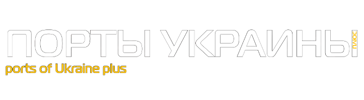

---
---

You can find my current contact info on Github at [dzirtusss](https://github.com/dzirtusss)

 
Or send me a message via the form below:



Some old articles about me from pre-dev life as published in:

|---|
| |
| **2014** |
| KyivPost, 30.10.2014 | [World In Ukraine: Finnish Business Briefs](https://kyivpost.com/article/content/business/finnish-business-briefs-370142.html) | [pdf](assets/article01.pdf) |
| Порты Украины, № 03 (135) 2014 | [В Украине – по европейским стандартам](https://portsukraine.com/node/3629) |
| |
| **2012** |
| БИЗНЕС №47 (1034) от 19.11.2012 | [Паркур](https://www.business.ua/articles/eyewitness/41232/) |
| Два Берега, №21, 25 сентября – 1 октября 2012 г. | [«Запорожкран» ПОДНИМАЕТ экономику Украины](https://sergiy-kaltsev.zp.ua/assets/files/dvaberega/21_db.pdf) | [pdf](assets/article03.pdf) |
| Урядовий кур’єр, 04.04.2012 | [На вході — ідеї, на виході — прибутки](https://ukurier.gov.ua/uk/articles/na-vhodi-ideyi-na-vihodi-pributki/) | [pdf](assets/article02.pdf) |
| Город, №2 (51), 30.03.2012 | [Промпарковый ландшафт в финском стиле](https://www.konecranes.com.ua/issue/34.pdf) |

 

